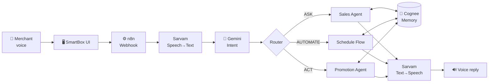

<div align="center">

# 🔊 SmartBox

### *Your Paytm Soundbox, now with an AI teammate.*

A voice-first AI assistant for Paytm merchants. Speak in Hindi, and SmartBox **answers, automates and acts** on your business.


[🎥 Demo Video](ADD_LINK) · [🌐 Live Prototype](ADD_LINK) · [📊 Slides](ADD_LINK)

</div>

---

## ❗ Problem

Merchants generate useful data every day (sales, repeat customers, preferences), but using it means opening dashboards, spreadsheets and apps they have no time to learn. Today's Soundbox only says *"payment received."*

## ✅ Solution

SmartBox turns the Soundbox into an **AI teammate**. Press, hold, speak, and get a **voice reply**.

| | What it does | Example |
|:--:|---|---|
| 🟦 **ASK** | Answers business questions | *"Aaj ki sale kitni hui?"* |
| 🟨 **AUTOMATE** | Turns repeated requests into scheduled workflows | *"Roz raat 9 baje sales report bhejna."* |
| 🟥 **ACT** | Performs actions, only after merchant approval | *"Regular customers ko monthly offer bhejo."* |

> 🔊 *"Aaj ki total sale ₹23,450 hai aur 126 transactions hue hain."*

---

## 🏗️ How It Works



| Component | Job |
|---|---|
| **Sarvam AI** | Hear and speak Indian languages |
| **Gemini** | Understand and classify the request into ASK / AUTOMATE / ACT |
| **n8n** | Execute, schedule and connect everything |
| **Cognee** | Remember merchant preferences and customer history |

### ⚙️ n8n Workflow


---

## ⭐ Key Features

- 🎙️ **Voice-first, Hindi-friendly:** no dashboard needed
- 🧠 **Remembers the business:** say *"Hindi mein message karna, discount 10% se zyada mat dena"* once, and every future offer follows it
- ⚡ **Real automation:** requests become executable n8n workflows, not just "okay, noted"
- 🙋 **Human-in-the-loop:** reading data is automatic; sending messages needs merchant approval

```text
READ → automatic          ACT → prepare → merchant approves → execute → verify → remember
```

---

## 🧰 Tech Stack

`HTML/CSS/JS` frontend · `n8n` orchestration · `Google Gemini` LLM · `Sarvam AI` STT + TTS · `Cognee` memory · `WhatsApp adapter` messaging

---

## 🚀 Run It

```bash
git clone https://github.com/Purvijain1234/Paytm-SmartBox.git
cd Paytm-SmartBox
python -m http.server 8000     # open http://localhost:8000
```

1. Import the workflow into n8n and add your **Gemini**, **Sarvam** and **Cognee** credentials.
2. Set your n8n webhook URL in `app.js`.
3. Press & hold the mic and speak.

---


## 👥 Team

| Name | GitHub |
|---|---|
| Purvi Jain | [@Purvijain1234](https://github.com/Purvijain1234) |
| Ranjeet Singh | [@ranjeet22](https://github.com/ranjeet22) |

<div align="center"><sub>Built for the Paytm AI Hackathon · Voice → Understand → Remember → Execute</sub></div>
