<div align="center">

# 🔊 SmartBox

### *Your Paytm Soundbox, now with an AI teammate.*

**A voice-first AI teammate for Paytm merchants that lets them <code>ASK</code>, <code>AUTOMATE</code> and <code>ACT</code> on their business, just by talking in their own language.**

<br/>


<br/>

[🎬 Demo](#-demo) •
[💡 Idea](#-the-idea) •
[🏗️ Architecture](#%EF%B8%8F-architecture) •
[⚙️ n8n Workflow](#%EF%B8%8F-n8n-workflow) •
[🧠 Memory](#-cognee--long-term-memory) •
[🚀 Run it](#-getting-started) •
[🗺️ Roadmap](#%EF%B8%8F-roadmap)

</div>

---

> [!TIP]
> **Reading this as a judge?** The 60-second version is right below. Every section after it is collapsible, so you can open only what you care about.

## ⚡ 60-Second Summary

| | |
|---|---|
| **The problem** | Merchants generate valuable data every day (sales, repeat customers, popular products) but it stays locked inside dashboards, spreadsheets and apps they don't have time to learn. |
| **Our solution** | SmartBox turns the Soundbox from a device that only *announces payments* into an AI teammate that *understands, remembers and acts*. |
| **How the merchant uses it** | Press, hold, speak in Hindi, release. SmartBox answers **in voice**. |
| **What it can do** | **ASK** questions about the business · **AUTOMATE** recurring tasks · **ACT** on approved business actions (e.g. customer promotions). |
| **What makes it different** | Voice-first · Indian-language · long-term memory · real executable workflows · human approval before any consequential action. |
| **Stack** | `Sarvam AI` (hear + speak) → `Gemini` (understand + decide) → `n8n` (execute) ↔ `Cognee` (remember) |

<details>
<summary><b>🗣️ Click to see what a merchant can say</b></summary>

<br/>

| The merchant says | Intent | What SmartBox does |
|---|---|---|
| *"Aaj ki sale kitni hui?"* | 🟦 `ASK` | Reads today's sales and replies in voice: *"Aaj ki total sale ₹23,450 hai aur 126 transactions hue hain."* |
| *"Roz raat 9 baje mujhe sales report bhejna."* | 🟨 `AUTOMATE` | Extracts task + frequency + time and turns it into a scheduled n8n workflow. |
| *"Mere regular customers ko monthly ration ka offer bhejo."* | 🟥 `ACT` | Finds regular customers, applies remembered preferences, drafts a message, asks for approval, sends, verifies, remembers. |
| *"Mere customers ko Hindi mein message karna."* | 🧠 Memory | Stores *language = Hindi* as a permanent merchant preference. |
| *"10% se zyada discount mat dena."* | 🧠 Memory | Stores *max discount = 10%* as a business rule. Later offers respect it automatically. |

</details>

---

## 📑 Table of Contents

<details open>
<summary><b>Click to expand / collapse</b></summary>

1. [🎬 Demo](#-demo)
2. [💡 The Idea](#-the-idea)
3. [❗ Problem Statement](#-problem-statement)
4. [✅ Proposed Solution](#-proposed-solution)
5. [🏗️ Architecture](#%EF%B8%8F-architecture)
6. [⚙️ n8n Workflow](#%EF%B8%8F-n8n-workflow)
7. [🟦 ASK Workflow](#-ask-workflow)
8. [🟨 AUTOMATE Workflow](#-automate-workflow)
9. [🟥 ACT Workflow](#-act-workflow)
10. [🧠 Cognee: Long-Term Memory](#-cognee--long-term-memory)
11. [🤖 Gemini: Intelligence & Routing](#-gemini--intelligence--routing)
12. [🎙️ Sarvam AI: Voice Layer](#%EF%B8%8F-sarvam-ai--voice-layer)
13. [🖥️ Frontend](#%EF%B8%8F-frontend)
14. [🛡️ Human-in-the-Loop Safety](#%EF%B8%8F-human-in-the-loop-safety)
15. [🧰 Tech Stack](#-tech-stack)
16. [🚀 Getting Started](#-getting-started)
17. [🔌 Webhook API Contract](#-webhook-api-contract)
18. [🔬 Prototype vs Production](#-prototype-vs-production)
19. [🗺️ Roadmap](#%EF%B8%8F-roadmap)
20. [🏆 Why SmartBox Stands Out](#-why-smartbox-stands-out)
21. [⚠️ Limitations & Responsible AI](#%EF%B8%8F-limitations--responsible-ai)
22. [❓ FAQ for Judges](#-faq-for-judges)
23. [📁 Repository Structure](#-repository-structure)
24. [👥 Team](#-team)

</details>

---

## 🎬 Demo

> [!NOTE]
> Replace the placeholders below with your real links and screenshots before submission. Put images in the [`asset/`](asset) folder.

| | |
|---|---|
| 🎥 **Demo video** | `[Watch the demo →](ADD_YOUTUBE_OR_DRIVE_LINK)` |
| 🌐 **Live prototype** | `[Open SmartBox →](ADD_DEPLOYED_LINK)` |
| 📊 **Presentation** | `[View the deck →](ADD_SLIDES_LINK)` |

### 📸 Screenshots

| SmartBox Home | Voice Interaction | Approval Card |
|:---:|:---:|:---:|
|  |  |  |

### The core interaction

```text
   PRESS & HOLD  ──►  SPEAK  ──►  RELEASE  ──►  SMARTBOX PROCESSES  ──►  VOICE RESPONSE
```

---

## 💡 The Idea

> **"Your Paytm Soundbox, now with an AI teammate."**

The Paytm Soundbox is already in millions of shops. Today it does one thing: **it tells the merchant when money arrives.**

SmartBox evolves it into a device that **understands the merchant, remembers the business, analyzes sales, automates repetitive work and takes approved actions on the merchant's behalf**.

The system is built around three primary capabilities:

| Capability | Meaning | Example |
|:---:|---|---|
| 🟦 **ASK** | Understand and answer questions | *"Aaj ki sale kitni hui?"* |
| 🟨 **AUTOMATE** | Turn repeated requests into scheduled workflows | *"Roz raat 9 baje sales report bhejna."* |
| 🟥 **ACT** | Perform business actions after applying memory, rules and merchant approval | *"Regular customers ko offer bhejo."* |

<details>
<summary><b>➕ Capabilities planned beyond the MVP</b></summary>

<br/>

- **MONITOR**: watch business activity and detect changes (e.g. a sudden sales drop)
- **ANALYZE**: identify sales patterns and business insights
- **REMEMBER**: maintain long-term merchant and customer context

</details>

---

## ❗ Problem Statement

Small and medium merchants generate a large amount of useful information through daily transactions, but **most of it stays passive**.

A merchant may *know* today's sales, transaction count, repeat customers, popular products, customer preferences and promotional history. But reaching that information usually means manually opening dashboards, spreadsheets, apps or messaging tools.

The gap widens when the merchant must repeat the same chores again and again:

- ✔️ checking sales every day
- ✔️ generating reports
- ✔️ remembering customer preferences
- ✔️ sending promotional messages
- ✔️ following up with customers
- ✔️ creating recurring reminders
- ✔️ deciding *when* to run a promotion

**The core barrier is the interface.** Dashboards demand time, literacy in software and comfort with English UIs. A shop owner behind a counter has none of these to spare.

---

## ✅ Proposed Solution

SmartBox replaces the dashboard with a **conversation**. Instead of learning software, the merchant simply talks.

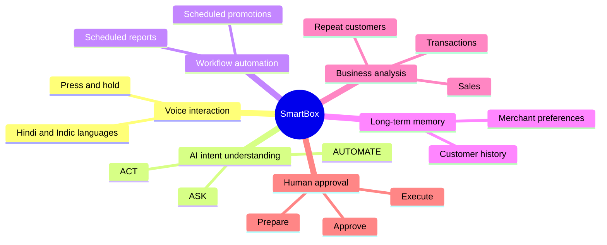

The request enters through a web interface that represents the SmartBox / Soundbox experience, is processed by the AI layer, and is routed to one of three workflows.

---

## 🏗️ Architecture

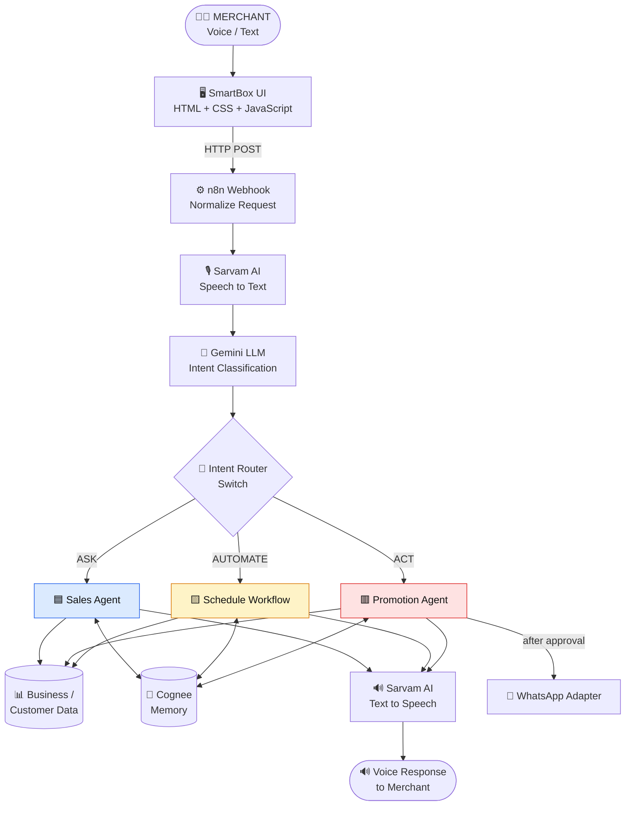

### Separation of responsibilities

The LLM is **not** responsible for everything. Each component has one job:

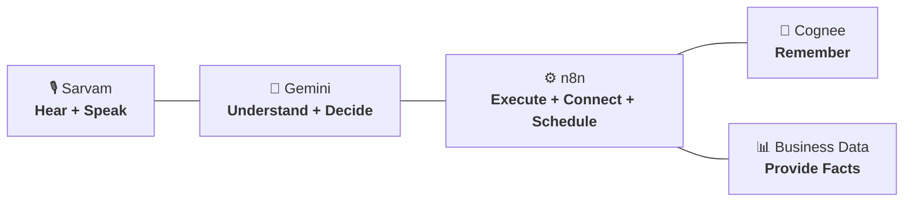

| Component | Role | One-liner |
|---|---|---|
| **Sarvam AI** | LISTEN | Converts Indian-language speech ↔ text |
| **Gemini** | UNDERSTAND | Classifies intent and reasons about the request |
| **Cognee** | REMEMBER | Keeps merchant and customer context across conversations |
| **n8n** | DO | Orchestrates, schedules and executes workflows |
| **Data adapter** | FACTS | Supplies transaction and customer information |

> This separation makes the system **easier to control, debug and expand**. The LLM decides; n8n executes; memory persists; data supplies the facts.

---

## ⚙️ n8n Workflow

**n8n is the execution and orchestration layer of SmartBox.** It connects the AI services, business logic, memory, schedules, APIs and actions.

### 📷 Complete workflow canvas

> [!IMPORTANT]
> **Add your n8n screenshot here.** Save it as `asset/n8n-workflow.png` (or update the path below).


<sub>Screenshot of the full n8n canvas showing the three workflow blocks connected through the Gemini-powered router.</sub>

### Main request router

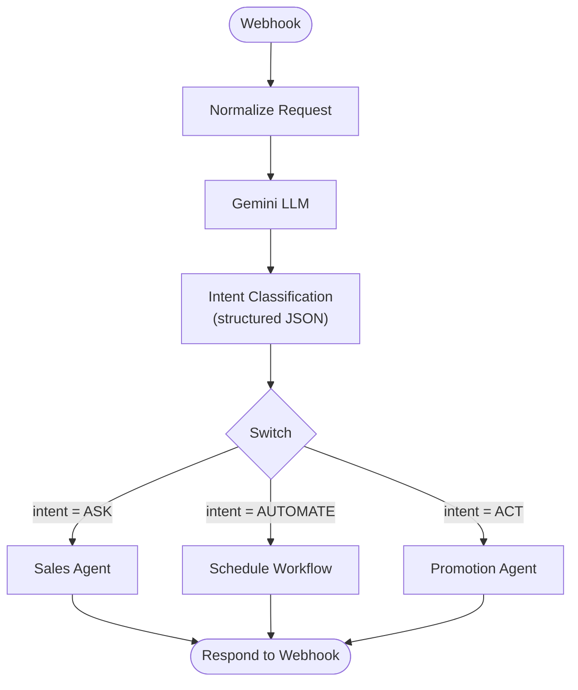

The Gemini classifier returns **structured output**, so the n8n `Switch` node can route reliably with no fragile text parsing.

### The three implementation blocks

The prototype started as three independent blocks. The **Gemini-powered router** is what unifies them into a single intelligent system.

<details open>
<summary><b>🟦 Block 1: Sales</b></summary>

<br/>

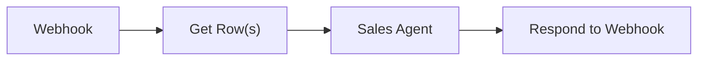

Handles sales-related questions (today's sales, transaction count, repeat customers).

</details>

<details>
<summary><b>🟨 Block 2: Scheduled Intelligence</b></summary>

<br/>

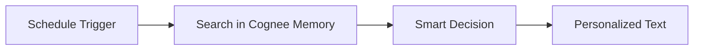

Handles scheduled and proactive activities. It reads memory and decides what to tell the merchant, without waiting to be asked.

</details>

<details>
<summary><b>🟥 Block 3: Promotion</b></summary>

<br/>

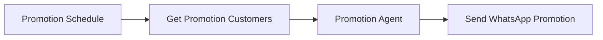

Handles customer promotion workflows: who to target, what to say and how to send it.

</details>

<details>
<summary><b>🔀 Why the intelligent router matters</b></summary>

<br/>

Without a router, each request would have to be sent manually to a specific workflow. With it:

```text
Merchant → Webhook → Gemini → Intent JSON → ASK | AUTOMATE | ACT
```

Merchants never choose a workflow. They just speak, and SmartBox picks the right one.

</details>

---

## 🟦 ASK Workflow

Answers merchant questions using business data.

> **"Aaj ki sale kitni hui?"**

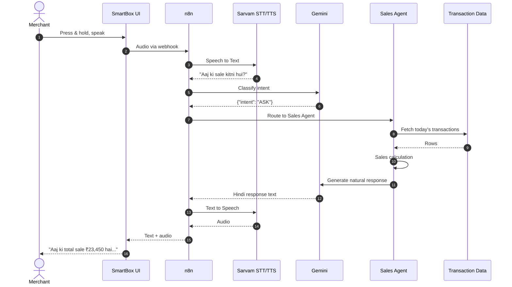

<details>
<summary><b>📝 Example response</b></summary>

<br/>

> 🔊 **"Aaj ki total sale ₹23,450 hai aur 126 transactions hue hain."**

</details>

> [!NOTE]
> The current prototype uses **simulated transaction data** inside the Sales Agent so the full AI workflow can be demonstrated end to end before connecting to a real Paytm transaction source. See [Prototype vs Production](#-prototype-vs-production).

---

## 🟨 AUTOMATE Workflow

Handles tasks that must happen **repeatedly** or **at a specified time**.

> **"Roz raat 9 baje mujhe sales report bhejna."**

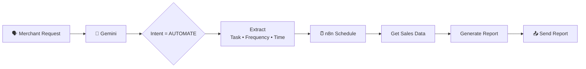

<details>
<summary><b>🔍 What Gemini extracts</b></summary>

<br/>

```json
{
  "intent": "AUTOMATE",
  "task": "sales_report",
  "frequency": "daily",
  "time": "21:00"
}
```

</details>

### 💥 The key difference

Most assistants say *"Okay, I'll remember that."* and nothing happens.

**SmartBox represents the request as an executable n8n workflow.** The task genuinely runs on schedule, and the merchant doesn't have to remind it.

---

## 🟥 ACT Workflow

Used when SmartBox needs to **perform an action** in the real world.

> **"Mere regular customers ko monthly ration ka offer bhejo."**

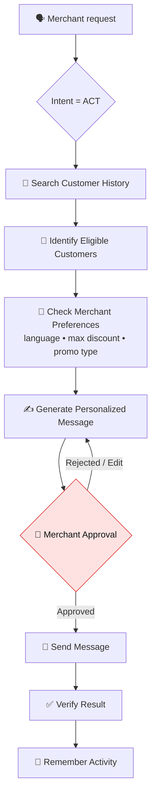

<details>
<summary><b>🧠 How memory shapes the action (worked example)</b></summary>

<br/>

Suppose Cognee already remembers:

```text
Preferred language  : Hindi
Maximum discount    : 10%
Preferred promotion : Monthly household essentials
```

Then *"Regular customers ke liye offer bana do"* produces a promotion that automatically respects:

| Memory | Effect on the generated offer |
|---|---|
| Language → Hindi | Message is written in Hindi |
| Max discount → 10% | Offer never exceeds 10% |
| Customer type → Regular | Only repeat customers are targeted |
| Context → Household essentials | Offer is framed around monthly ration |

The merchant never had to repeat those rules. That is the difference between a chatbot and a teammate.

</details>

> [!IMPORTANT]
> Actions such as sending customer messages **never fire blindly**. SmartBox *prepares* the action; the **merchant approves** it. See [Human-in-the-Loop Safety](#%EF%B8%8F-human-in-the-loop-safety).

---

## 🧠 Cognee: Long-Term Memory

**Cognee** is the memory layer. It lets SmartBox remember information that should persist **beyond a single conversation**, so the assistant *knows the business* instead of starting from zero every time.

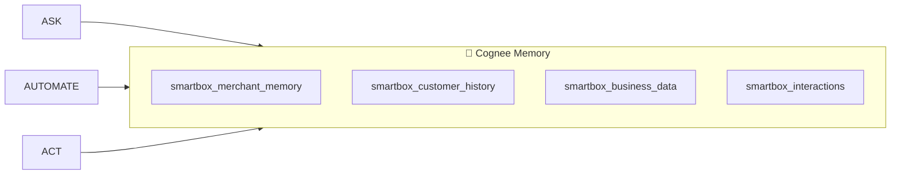

### Datasets

| Dataset | Stores |
|---|---|
| `smartbox_merchant_memory` | Merchant ID · business type · preferred language · communication style · discount limits · promotion preferences · business rules |
| `smartbox_customer_history` | Customer interactions · purchase history · repeat-customer status · previous promotions · customer preferences |
| `smartbox_business_data` | Sales · transactions · products · promotions · business events |
| `smartbox_interactions` | Previous requests · previous AI actions · merchant approvals · workflow results |

<details>
<summary><b>💬 Example: teaching SmartBox a preference</b></summary>

<br/>

**Step 1. Merchant teaches:**

> *"Mere customers ko Hindi mein message karna aur discount 10% se zyada mat dena."*

**Step 2. SmartBox stores:**

```text
preferred_language = Hindi
max_discount       = 10%
```

**Step 3. Days later, merchant asks:**

> *"Regular customers ke liye offer bana do."*

**Step 4. ACT workflow searches memory and generates an offer in Hindi, capped at 10%, aimed at regular customers, framed around household essentials.**

</details>

---

## 🤖 Gemini: Intelligence & Routing

Gemini is the **reasoning and classification layer**. Its first responsibility is to understand the merchant's message and classify it into exactly one intent.

```text
ASK   |   AUTOMATE   |   ACT
```

<details open>
<summary><b>🧪 Classification examples</b></summary>

<br/>

| Input | Output |
|---|---|
| *"Aaj ki sale kitni hui?"* | `{ "intent": "ASK" }` |
| *"Roz raat 9 baje mujhe sales report bhejna."* | `{ "intent": "AUTOMATE" }` |
| *"Mere regular customers ko WhatsApp par offer bhejo."* | `{ "intent": "ACT" }` |

</details>

**Why structured JSON?** It lets the n8n `Switch` node route deterministically. The LLM *decides*, but the workflow engine *controls* what happens next.

---

## 🎙️ Sarvam AI: Voice Layer

Sarvam AI powers **Indian-language voice interaction** in both directions.

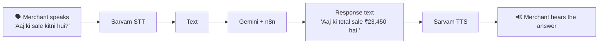

The merchant gets a complete **VOICE → AI → VOICE** experience, matching the familiarity of a voice-enabled merchant device rather than a conventional text chatbot.

---

## 🖥️ Frontend

The frontend is intentionally simple: **plain HTML, CSS and JavaScript** with no build step. It is a digital version of the SmartBox / Soundbox experience.

<details>
<summary><b>🧩 Main UI components</b></summary>

<br/>

- 🔊 SmartBox visual
- 🎤 Voice interaction button (press-and-hold recording)
- 💬 Conversation display (merchant query + AI response)
- 📊 Today's sales
- 🧾 Transaction count
- 🔁 Repeat customers
- 🤖 AI activity feed
- 💡 AI insights
- ✅ Approval cards

</details>

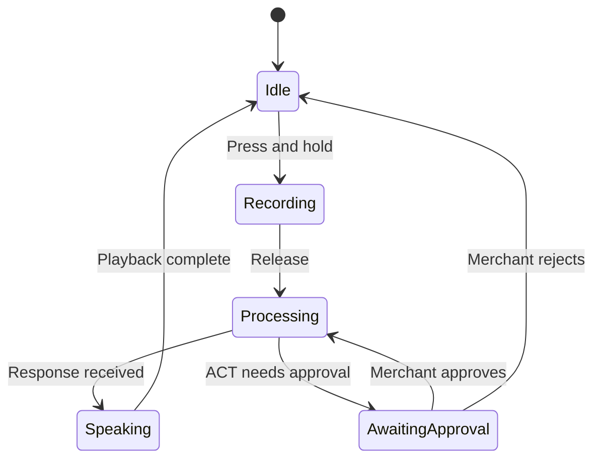

The frontend records audio, sends it to the **n8n webhook**, and plays back the voice response.

---

## 🛡️ Human-in-the-Loop Safety

SmartBox clearly distinguishes **information** from **action**.

| Type | Examples | Behaviour |
|---|---|---|
| 🟢 **Read-only** | Sales lookup · transaction count · customer count · business insights · memory search · analysis | Happens **automatically** |
| 🔴 **Consequential** | Send customer message · launch promotion · apply discount · create campaign · external business action | Requires **merchant approval** |

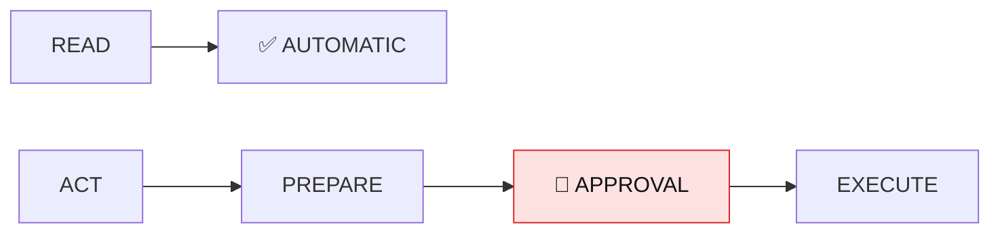

> **The AI can prepare the action, but the merchant remains in control.**

Additional guardrails come from **memory-backed business rules** (e.g. *max discount 10%*), so even prepared actions stay inside limits the merchant has set.

---

## 🧰 Tech Stack

| Layer | Technology | Purpose |
|---|---|---|
| Frontend | **HTML** | UI structure |
| Frontend | **CSS** | SmartBox interface |
| Frontend | **JavaScript** | Voice recording and API communication |
| Workflow Engine | **n8n** | Orchestration and automation |
| LLM | **Google Gemini** | Intent understanding and AI reasoning |
| Speech-to-Text | **Sarvam AI** | Indian-language voice recognition |
| Text-to-Speech | **Sarvam AI** | Voice response |
| Memory | **Cognee** | Long-term merchant / customer memory |
| Data Layer | Simulated transaction data / adapter | Prototype transaction information |
| Messaging | WhatsApp / API adapter | Customer communication |
| Scheduling | **n8n** | Recurring business workflows |
| Web API | **n8n Webhook** | Frontend-to-AI communication |

---

## 🚀 Getting Started

<details open>
<summary><b>1️⃣ Prerequisites</b></summary>

<br/>

- A modern browser with **microphone access** (Chrome recommended)
- An **n8n** instance (self-hosted or n8n Cloud)
- API access for **Google Gemini** and **Sarvam AI**
- A running **Cognee** instance (or endpoint)
- *(Optional)* a WhatsApp Business API / adapter for the send step

</details>

<details open>
<summary><b>2️⃣ Clone and run the frontend</b></summary>

<br/>

```bash
git clone https://github.com/Purvijain1234/Paytm-SmartBox.git
cd Paytm-SmartBox

# Option A: Python
python -m http.server 8000

# Option B: Node
npx serve .
```

Open **http://localhost:8000**.

> [!NOTE]
> Browsers only allow microphone access on **`localhost` or HTTPS**. Opening `index.html` directly from the file system may block recording.

</details>

<details>
<summary><b>3️⃣ Set up n8n</b></summary>

<br/>

1. Open your n8n instance → **Workflows → Import from file** and import the SmartBox workflow JSON.
2. Add credentials in n8n:
   - **Google Gemini** API key
   - **Sarvam AI** subscription key (STT + TTS)
   - **Cognee** endpoint / API key
   - **WhatsApp** provider credentials *(optional)*
3. Make sure the four Cognee datasets exist:
   `smartbox_merchant_memory`, `smartbox_customer_history`, `smartbox_business_data`, `smartbox_interactions`
4. **Activate** the workflow and copy the **Production Webhook URL**.

</details>

<details>
<summary><b>4️⃣ Connect the frontend to n8n</b></summary>

<br/>

In [`app.js`](app.js), set the webhook URL to the one copied from n8n:

```js
const WEBHOOK_URL = "https://<your-n8n-host>/webhook/<smartbox-path>";
```

Reload the page, then **press and hold** the mic button and speak.

</details>

<details>
<summary><b>5️⃣ Try these prompts</b></summary>

<br/>

| Try saying | Expected route |
|---|---|
| *"Aaj ki sale kitni hui?"* | 🟦 ASK → Sales Agent |
| *"Kitne transactions hue aaj?"* | 🟦 ASK → Sales Agent |
| *"Har raat 9 baje mujhe sales report bhejna."* | 🟨 AUTOMATE → Schedule |
| *"Mere customers ko Hindi mein message karna aur discount 10% se zyada mat dena."* | 🧠 Memory write |
| *"Mere regular customers ko monthly ration ka offer bhejo."* | 🟥 ACT → Promotion Agent → Approval |

</details>

---

## 🔌 Webhook API Contract

<details>
<summary><b>📡 Click to see the request / response shape</b></summary>

<br/>

> [!NOTE]
> Illustrative contract. Adjust field names to match your actual webhook node.

**Request**

```bash
curl -X POST "https://<your-n8n-host>/webhook/<smartbox-path>" \
  -H "Content-Type: application/json" \
  -d '{
        "merchant_id": "demo_merchant_001",
        "input_type": "text",
        "message": "Aaj ki sale kitni hui?"
      }'
```

**Response**

```json
{
  "intent": "ASK",
  "reply_text": "Aaj ki total sale ₹23,450 hai aur 126 transactions hue hain.",
  "reply_audio": "<base64 or URL from Sarvam TTS>",
  "requires_approval": false
}
```

**ACT response (approval required)**

```json
{
  "intent": "ACT",
  "reply_text": "Maine 43 regular customers ke liye Hindi mein 10% ka offer taiyaar kiya hai. Bhej doon?",
  "draft_message": "…",
  "requires_approval": true
}
```

</details>

---

## 🔬 Prototype vs Production

The system is developed **in stages**, and we are transparent about what is real today.

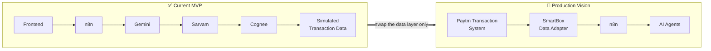

- **Today:** transaction information is **simulated**, so the AI workflow can be built and demonstrated without depending on an unavailable / private Paytm production API.
- **Production:** replace the simulated layer with an **official Paytm / merchant transaction API or approved adapter**. **The rest of the architecture stays largely the same.**

That is the payoff of the adapter-based design: the AI, memory, voice and workflow layers are already independent of where the data comes from.

---

## 🗺️ Roadmap

<details open>
<summary><b>Phase 1: Core Voice MVP</b> ✅</summary>

<br/>

- [x] Frontend
- [x] n8n webhook
- [x] Sarvam STT
- [x] Gemini intent classifier
- [x] ASK / AUTOMATE / ACT routing
- [x] Sarvam TTS

**Goal:** the merchant can speak naturally and receive a voice response.

</details>

<details>
<summary><b>Phase 2: Memory</b> ✅</summary>

<br/>

- [x] Cognee merchant memory
- [x] Merchant preferences
- [x] Customer history
- [x] Interaction history
- [x] Business context

**Goal:** SmartBox remembers the merchant's business.

</details>

<details>
<summary><b>Phase 3: Business Intelligence</b> ✅</summary>

<br/>

- [x] Sales analysis
- [x] Transaction trends
- [x] Repeat customer identification
- [x] Business insights
- [x] Personalized recommendations

**Goal:** SmartBox moves from answering questions to *understanding* the business.

</details>

<details>
<summary><b>Phase 4: Automation</b> ✅</summary>

<br/>

- [x] Scheduled reports
- [x] Recurring reminders
- [x] Scheduled promotions
- [x] Automated monitoring

**Goal:** SmartBox performs repetitive work automatically.

</details>

<details>
<summary><b>Phase 5: ACT</b> ✅</summary>

<br/>

- [x] Customer segmentation
- [x] Personalized campaigns
- [x] Merchant approval
- [x] WhatsApp integration
- [x] Action verification
- [x] Action memory

**Goal:** SmartBox becomes an AI teammate capable of executing approved business actions.

</details>

<details open>
<summary><b>Phase 6: Proactive AI</b> 🔭 <i>(vision)</i></summary>

<br/>

- [ ] Detect business changes automatically
- [ ] Analyze the *reason* behind a change
- [ ] Check customer history for context
- [ ] Suggest the next best action

SmartBox shouldn't always wait to be asked:

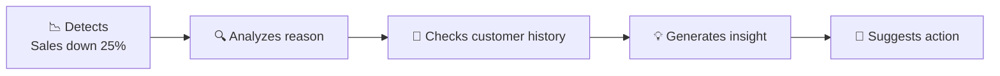

> 🔊 **"Aapki sales pichhle 7 din ke average se 25% kam hai. Aapke 43 regular customers mein se 18 ne is week purchase nahi kiya. Kya main unke liye ek personalized reminder campaign prepare karun?"**

This is the shift from **AI assistant → AI teammate.**

</details>

---

## 🏆 Why SmartBox Stands Out

SmartBox is **not another generic chatbot.**

| ⭐ Differentiator | What it means |
|---|---|
| 🎙️ **Voice-first** | The merchant talks naturally instead of navigating complicated dashboards. |
| 🧠 **Context-aware** | Remembers preferences, rules and customer history. It knows the business. |
| ⚡ **Action-oriented** | Executes workflows instead of only generating text. |
| 🔗 **Workflow-driven** | n8n converts AI decisions into real, executable, schedulable processes. |
| 🇮🇳 **Indian-language focused** | Sarvam enables Hindi and other Indian-language voice interaction. |
| 🙋 **Human-controlled** | Consequential actions require merchant approval. |
| 🔭 **Proactive (long-term)** | Aims to surface opportunities before the merchant asks. |

### The transformation

> **From** a Soundbox that only tells the merchant *when money arrives*
> **to** an AI teammate that *understands the business, remembers context, automates repetitive work, and helps take action.*

```text
             MERCHANT
                 │  "SmartBox, aaj kya karna chahiye?"
                 ▼
        ┌─────────────────┐
        │    SMARTBOX     │
        │   AI TEAMMATE   │
        └────────┬────────┘
                 │  Understands business
                 │  Remembers context
                 │  Analyzes data
                 │  Decides next step
                 │  Executes workflow
                 ▼
        ┌─────────────────┐
        │    MERCHANT     │
        │  gets result /  │
        │ approves action │
        └─────────────────┘
```

---

## ⚠️ Limitations & Responsible AI

<details>
<summary><b>Click to read our honest limitations</b></summary>

<br/>

- **Simulated data:** transaction data in the MVP is simulated. No real Paytm production data is used.
- **Approval-gated actions:** customer-facing actions are prepared for merchant approval rather than fired automatically.
- **Rule-bound generation:** offers are constrained by merchant-defined rules stored in memory (language, discount cap).
- **LLM variability:** intent classification relies on an LLM; structured JSON output and a deterministic `Switch` node reduce, but don't eliminate, misclassification risk.
- **Privacy:** customer data must be handled under applicable data-protection requirements before any production rollout. A real deployment would add authentication, consent management and audit logs.

</details>

---

## ❓ FAQ for Judges

<details>
<summary><b>Why n8n instead of letting the LLM do everything?</b></summary>

<br/>

Because LLMs are good at *deciding* but should not be trusted as the sole *executor*. n8n gives us deterministic routing, scheduling, retries, visibility into every step and easy integration with external APIs. Gemini understands; n8n executes.

</details>

<details>
<summary><b>Why voice-first?</b></summary>

<br/>

Many merchants are on their feet, busy with customers, and more comfortable speaking Hindi or a regional language than navigating an English dashboard. The Soundbox is already a trusted, familiar voice device on their counter.

</details>

<details>
<summary><b>What makes the memory useful and not a gimmick?</b></summary>

<br/>

Memory changes outputs. A remembered *"Hindi, max 10% discount"* directly shapes every future promotion, so the merchant states their rules once and never repeats them.

</details>

<details>
<summary><b>Is it safe for SmartBox to message customers?</b></summary>

<br/>

SmartBox follows a strict **READ → automatic, ACT → prepare → approve → execute** model. The merchant approves consequential actions, and business rules from memory constrain what is prepared.

</details>

<details>
<summary><b>How does this reach production?</b></summary>

<br/>

Only the data layer changes: swap simulated data for an official Paytm / merchant transaction API or approved adapter. Voice, LLM, memory and workflow layers are already decoupled from the data source.

</details>

<details>
<summary><b>How is this different from a dashboard with a chatbot?</b></summary>

<br/>

A chatbot answers. SmartBox **remembers, schedules and acts**: it turns a spoken request into an executable workflow, applies stored business rules, and completes the loop with verification and action memory.

</details>

---

## 📁 Repository Structure

```text
Paytm-SmartBox/
├── asset/            # Images, screenshots, workflow diagram, static assets
├── index.html        # SmartBox UI structure
├── styles.css        # SmartBox interface styling
├── app.js            # Voice recording, webhook calls, UI logic
├── .gitignore
└── README.md         # You are here
```

> [!TIP]
> Consider adding an `n8n/` folder with your exported workflow JSON (e.g. `n8n/smartbox-workflow.json`) so judges can import and inspect the exact workflow.

---

## 👥 Team

| Name | Role | GitHub |
|---|---|---|
| **Purvi Jain** | ADD ROLE | [@Purvijain1234](https://github.com/Purvijain1234) |
| **ADD NAME** | ADD ROLE | [@ranjeet22](https://github.com/ranjeet22) |
| **ADD NAME** | ADD ROLE | [@handle](https://github.com/) |

---

<div align="center">

### 🔊 SmartBox

**Voice → Understand → Remember → Execute**

*Built for the Paytm AI Hackathon*

⭐ If you like the idea, star the repo!

</div>
